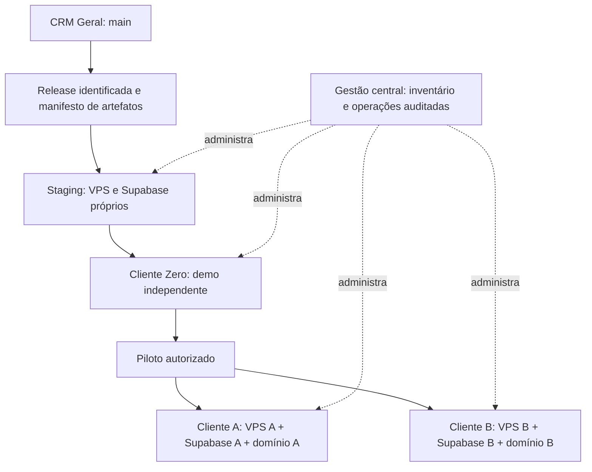

# Fase 2.4 — arquitetura de distribuição comercial do CRM Geral

## 1. Visão

**APROVADO pelo pedido desta fase:** uma base oficial de código, uma linhagem de releases e uma instalação isolada por cliente. Cada instalação possui VPS dedicada, projeto Supabase dedicado, domínio, secrets e configuração próprios. Infraestrutura, deploy e manutenção são inicialmente gerenciados centralmente pelo responsável pelo CRM Geral; o cliente recebe o serviço funcionando.

Este documento define a arquitetura-alvo, não certifica que a distribuição já funciona. **CONFIRMADO no checkout:** base `main` em `591c99635db11c9a6b1483c46fa3196b76d8e5a1`, Fase 2.2 integrada, runtime PostgreSQL local documentado e relatórios de seleção funcional disponíveis. **PROPOSTA** identifica desenho futuro ainda não implementado. Documento elaborado em 02/10/2026.

Referências: [contrato do fork](../AGENTS.md), [runtime local](LOCAL_POSTGRES_SETUP.md), [seleção funcional](UPSTREAM_FUNCTIONAL_SELECTION.md), [hardening](UPSTREAM_HARDENING_PHASE_2_2.md), [packaging](doctrine/packaging.md), [versionamento](doctrine/versionamento.md) e [runbook herdado](runbooks/deploy.md). A seleção funcional e a auditoria upstream são arquivos preexistentes não rastreados nesta tarefa; este commit não os incorpora. A autoridade do modelo comercial é o pedido atual, não a monetização histórica do Deskcomm.

## 2. Princípios arquiteturais

- `main` é a única base oficial; não criar branches permanentes por cliente.
- Instalações consomem artefatos identificáveis da mesma linhagem, não builds personalizados na VPS.
- Dados e execução ficam isolados por cliente; gestão central não significa banco/runtime compartilhado.
- Configuração, módulos, flags, permissões e integrações expressam diferenças entre clientes.
- Migrations são registradas, versionadas e verificáveis; nunca editar migration aplicada.
- Instalação, atualização, falha e recuperação precisam de responsável, registro e próximo passo.
- Capacidade opcional ausente não derruba o CRM base; disponibilidade de integração não equivale a permissão de usuário.
- Backups só sustentam recuperação quando o restore correspondente foi demonstrado.

Não se aprova neste documento a classificação definitiva de cada feature da Fase 2.3, preço, SLA, RPO, RTO, fornecedor de VPS ou plano Supabase.

## 3. Topologia geral

Gestão central proposta: inventário operacional sem dados comerciais, cofre de secrets e registros de operação. Inicialmente pode ser um processo documentado; não exige construir painel/control plane próprio. Nenhum runtime/worker/filesystem de A atende B. Serviços de fornecedores e credenciais de administração central são riscos comuns: isolamento reduz propagação entre instalações, mas não promete ausência de falha regional, de conta ou de release.

## 4. Base de código e releases

Release proposta: tag Git imutável `vMAJOR.MINOR.PATCH`, commit contido em `main`, changelog e manifesto que amarre app, worker, scheduler, migrations e configuração. Cada imagem tem versão e digest; o mesmo conjunto aprovado é promovido entre ambientes, sem recompilar para cada cliente. Tags móveis não são identidade de instalação.

Semantic Versioning, alinhado ao contrato operacional herdado:

| Incremento | Critério proposto |
|---|---|
| PATCH | Correção compatível, sem remover capacidade nem exigir ação manual do operador |
| MINOR | Nova capacidade compatível; atualização automatizável, preservando instalação existente |
| MAJOR | Quebra de contrato/API/configuração/schema suportado ou intervenção inevitável; requer plano explícito de migração |

Os exemplos `v1.0.0`, `v1.1.0` e `v1.1.1` são ilustrativos, não releases criadas ou versão inicial escolhida. Clientes podem estar temporariamente em versões distintas por janela de atualização; cada combinação precisa constar da política de suporte. Correção urgente deve retornar à linhagem oficial, não permanecer como patch particular.

**CONFIRMADO:** o workflow versionado já prevê imagens de app/worker/scheduler, mas o compose ainda contém defaults do namespace upstream e `stable`. Antes de distribuir o fork, será necessário validar namespace, permissões e artefatos realmente publicados pelo CRM Geral. A existência do workflow não comprova essas publicações. Nenhum workflow/compose foi alterado nesta fase.

## 5. Infraestrutura por cliente

Cada instalação recebe identificador operacional estável, VPS, projeto Supabase, domínio e conjunto de credenciais exclusivos. App, workers, scheduler e serviços de canal/cache usados pelo cliente executam na sua VPS ou em recursos externos exclusivos conforme contrato. Supabase provê banco/Auth/Storage/Realtime do projeto dedicado.

Vínculo obrigatório no inventário: cliente → instalação → VPS → Supabase Project → domínio → release. Uma conexão configurada para o projeto de outro cliente deve ser detectada como erro de provisionamento, não aceita por estar tecnicamente acessível.

Sizing é individual, baseado em carga observada; não fixar CPU/RAM/disco ou capacidade comercial sem testes. Dados compartilhados permitidos no plano central limitam-se ao operacional explicitamente autorizado, nunca uma tabela única de contatos/vendas entre clientes.

## 6. Supabase

Topologia aprovada: organização/conta sob controle central com projetos separados para `crm-geral-staging`, `crm-geral-demo` e cada cliente. Os nomes são convenção conceitual; nenhum projeto foi criado. Região, plano, quotas, recuperação e permissões administrativas permanecem decisões abertas.

Produção usa serviços Supabase reais; não transportar o emulador local de Auth/REST como mecanismo produtivo. Setup futuro precisa validar extensões, helpers, roles, RLS, buckets, publicações Realtime, URLs de Auth e migrations contra o serviço real. Não importar o bootstrap local de schemas gerenciados sem análise.

Cada projeto tem chaves/conexões próprias. Service role fica no servidor e não substitui filtros de organização. Acesso humano administrativo deve ter escopo mínimo, rastreabilidade e proteção de conta. Permissões da organização central e processos de recuperação da conta também entram no risco operacional.

## 7. VPS

**APROVADO:** uma VPS dedicada por cliente, gerenciada centralmente. Não há proposta de hospedagem multi-cliente como padrão. Volumes de app/canal/cache, logs e runtime ficam exclusivos; backups não podem depender apenas do disco da mesma VPS.

PROPOSTA: serviços próprios distribuídos por imagens publicadas pelo CI, com digests fixados no manifesto; dependências de terceiros referenciadas por versões aprovadas, sem republicá-las como próprias. Arquivos de configuração de instalação são reproduzíveis. Não compilar produto no servidor do cliente como procedimento normal.

Rede privada para componentes internos, portas públicas limitadas ao necessário, HTTPS no ingresso e acesso administrativo controlado. Escolha de proxy e sua relação com compose devem ser documentadas; o runbook herdado exige preservar labels quando o host usa proxy externo. Isso ainda precisa homologação na topologia escolhida.

## 8. Ambientes

| Ambiente | Topologia e finalidade | Limite |
|---|---|---|
| Local | PostgreSQL local, adaptadores e fixtures; desenvolvimento/debug/testes | Não demonstra equivalência Supabase, Storage, Realtime ou instalação produtiva |
| Staging | Projeto Supabase e VPS próprios; arquitetura equivalente à produção | Instalação limpa, migrations, integrações, upgrade/rollback e falhas controladas; dados fictícios |
| Demo | Instalação comercial real e independente, Cliente Zero | Experiência de cliente e homologação interna; sem atalhos do local |
| Cliente | VPS/Supabase/domínio dedicados de produção | Dados reais e mudanças somente pelo fluxo aprovado |

Sem compartilhar secrets entre ambientes. Demo não substitui staging; um experimento destrutivo em staging não deve derrubar demonstrações. Uso excepcional de dados de cliente em diagnóstico exige procedimento próprio; preferência por reprodução com dados fictícios.

## 9. Cliente Zero

`crm-geral-demo` será a primeira instalação completa obtida pelo processo comercial: release publicada do fork, Supabase real, VPS dedicada, domínio/HTTPS, administrador legítimo e configuração rastreável. Não copiar `.env.local`, seed de desenvolvimento, senha local, dumps de clientes ou node_modules.

Critério futuro: provisionar do zero com runbook, registrar versão/schema/configuração, validar login e fluxo CRM, integração habilitada e mensagens de ausência das demais. Depois demonstrar atualização e recuperação. A demo utiliza dados fictícios, credenciais próprias e mesma linhagem de releases; não vira branch de demonstração.

## 10. Configuração por cliente

PROPOSTA: distinguir configuração de instalação (domínio, transportes e serviços), organização (branding, módulos e regras), permissões (papéis) e secrets (cofre/runtime). Preferir mecanismos existentes de banco/settings antes de criar outra fonte concorrente.

Configuração tem versão/contrato e defaults explícitos; alteração produz ator, instante, instalação, diferença sem secrets e validação. Atualização não sobrescreve personalizações legítimas. Valores secretos são referências seguras ou material fornecido ao runtime, não cópia em inventário/manifesto.

As configurações de negócio devem ser consultáveis e alteráveis na superfície administrativa correspondente. A ferramenta de operação futura precisa informar valor efetivo, origem e motivo de bloqueio, sem exibir credencial. Export/restauração de configuração acompanha compatibilidade da release.

## 11. Feature flags

PROPOSTA: capacidade efetiva depende de módulo suportado pela release, habilitação na instalação/organização, permissão do ator e prontidão da integração quando necessária. Flag ligada não concede papel nem cria serviço externo. Flags desconhecidas ou configuração inválida não ativam um módulo opcional por acidente.

Flags devem governar menus/telas, endpoints, ferramentas de IA/MCP, produtores de eventos, workers, jobs e integrações pertinentes. Rotas de administração da capacidade continuam acessíveis aos papéis autorizados. Endpoint e worker validam do lado servidor; esconder botão não é isolamento.

Desativação: bloquear novas ações e definir destino dos jobs em andamento. Não apagar histórico; permitir leitura/exportação autorizada quando aplicável. Operações irreversíveis já enviadas não são “desfeitas” por desligar a flag. Cache de flags precisa invalidação ou prazo conhecido, com rastreio da versão usada pelo job. Estados úteis: não habilitado, habilitado sem configuração, pronto, falha operacional.

Exemplos conceituais `agenda`, `proposals`, `campaigns`, `finance`, `ai` não são chaves aprovadas nem flags implementadas. Nome/catálogo definitivo depende da Fase 2.3.

## 12. Core e módulos

Core contém contratos fundamentais e compartilhados — identidade, organização/RLS, autorização, relacionamentos, oportunidades, configuração, eventos e visibilidade. O recorte final de features depende de decisão funcional. Agenda, propostas, campanhas, financeiro comercial e IA avançada são exemplos candidatos, não inclusão automática.

Estratégias de deploy conscientes dos módulos:

| Nível | Vantagem | Limitação / risco |
|---|---|---|
| UI desativada | Simplicidade visual | Não impede API, job ou ferramenta de agir; insuficiente sozinho |
| UI + runtime desativados, schema comum | Uma cadeia de migrations e releases; reativação simples | Schema/dados continuam presentes; exige guards em todos os executores |
| Schema não provisionado | Menos objetos de módulos não usados | Variações de schema, dependências e testes combinatórios; queries/RPCs precisam tolerar ausência |

**Recomendação inicial PROPOSTA:** schema comum completo **do produto aprovado**, flags e runtime condicionado. Isso não significa importar o baseline inteiro do upstream ou todas as features da seleção. Simplifica upgrades, mas amplia objetos/permissões a revisar e não reduz dados já existentes. Schema opcional só após caso real justificar a complexidade e contrato de provisionamento. Desligar módulo não faz DROP por padrão.

## 13. Customizações

Ordem aprovada de preferência: configuração → feature flag → módulo opcional → template/regra → extensão isolada → código específico em último caso. Não remover funcionalidade do código comum porque um cliente não usa.

Exceção de código específico deve ter contrato delimitado, entradas/saídas, testes, proprietário e plano de manutenção. Não espalhar condicionais por nome de cliente em handlers/UI/workers. Preferir mecanismo compartilhado que aceite configuração; quando inevitável, componente/adaptador isolado compatível com a mesma release, sem branch permanente.

Não se cria agora diretório `client-overrides` ou framework equivalente. Nomes e limites serão definidos com um caso concreto. Código secreto ou duplicação de core fora do repositório também criariam divergência operacional e precisam ser evitados.

## 14. Estratégia futura de extensões

Evolução: core → módulos internos com limites explícitos → flags completas → extensões quando casos recorrentes demonstrarem necessidade. Não implementar marketplace/plugin loader nesta fase.

O upstream tem extensões declarativas restritas; elas não equivalem a instalar código arbitrário ou schema financeiro. Uma futura extensão deve declarar compatibilidade, capacidade, permissões, eventos, configuração, observabilidade e política de desligamento/remoção. Não prometer que o mecanismo atual resolve qualquer customização.

## 15. Relação com Deskcomm upstream

Fluxo aprovado: fetch/congelamento de SHA → auditoria → comparação com baseline/fork → classificação → adaptação → testes → incorporação seletiva na base oficial. Nunca merge automático. `origin` é o fork; upstream deve ser identificado explicitamente, sem confundir referências.

Categorias: segurança, bugfix, core, módulo opcional, ideia para extensão, não incorporar. Guardar origem e justificativa da adaptação; correção de segurança pode exigir prioridade técnica sem autorizar importação de módulo inteiro. Preservar runtime local e distribuição planejada, marca, configurações e compatibilidade dos clientes.

Não transportar doutrina comercial, CI, baseline, tipos gerados ou lockfile por substituição integral. Releases do CRM Geral pertencem à sua linhagem; tags históricas upstream permanecem referências, não seleção automática para deploy. Features seguem a decisão do produto e os gates aplicáveis.

## 16. Release pipeline

Pipeline-alvo: desenvolvimento/revisão → `main` → candidato identificado → imagens/manifesto → staging → backup e validação prévia → migrations compatíveis → deploy do conjunto → health/smoke/jornada visual → aprovação → release imutável → Cliente Zero → piloto autorizado → grupos → demais clientes.

Promover o mesmo artefato aprovado; não reconstruir cada promoção. Versão candidata e release final devem ter mapeamento verificável para os mesmos digests aprovados. Manifesto pode ser separado do número exibido no app, evitando recompile só para renomear artefato.

Gates futuros: typecheck/lint/testes relevantes, banco install/update/RLS real, E2E, imagens, instalação fresca, upgrade e rollback suportado. Controle de acessos e dependências opcionais entram na homologação. Não afirmar que CI verde já prova instalação fresca: o relatório 2.2 registra limites do local.

Pacote incompleto de app/worker/scheduler não é release utilizável. Registrar resultado, aprovador, versões/digests e limites. Falha interrompe promoção e abre incidente com responsável e próximo passo.

## 17. Atualizações

Por cliente: verificar identidade/versões/flags e saúde prévia → confirmar compatibilidade e janela → obter backup restaurável → pausar produtores/consumidores necessários → executar plano de migration/deploy → health → smoke → retomada monitorada → registrar conclusão.

**Ordem não universal:** migration aditiva compatível pode preceder deploy; mudança incompatível exige manutenção/coordenar app e workers. Não seguir cegamente “deploy depois migration” nem “migration sempre antes”. O manifesto da release define pré/pós-migrations, versões que coexistem e possibilidade de rollback. Migração longa exige plano de bloqueios e progresso.

Atualizar staging, demo, piloto autorizado, grupo pequeno e demais em janelas próprias. Não usar produção de cliente como teste de instalação. Inventário registra a versão realmente em execução e pendências, não apenas o deploy solicitado. Em falha, parar expansão e aplicar o plano de recuperação daquele cliente.

## 18. Migrations

Schema de produto evolui por migration versionada; nenhuma edição de aplicada ou SQL manual não registrado. Preservar tripla do repositório: migration nova + apêndice idempotente no baseline + MANIFEST. Instalação fresca aplica baseline identificado e registra equivalência com a cadeia; update aplica somente pendentes, sem duplicar efeitos.

PROPOSTA: ledger por instalação com IDs/checksums/status/instantes, baseline de origem e checkpoints de schema; conciliar com histórico nativo da ferramenta escolhida. Checksum divergente ou migration parcialmente aplicada bloqueia a atualização até diagnóstico. Não confiar no último número de arquivo como prova de todos os anteriores.

Identidades futuras: **App version** (release/digests), **Schema version** (cadeia verificada/checkpoint) e **Config version** (contrato/transformações). Manifesto declara faixas compatíveis. Boot e plano de deploy verificam incompatibilidade sem “tentar seguir”; leitura/rota mínima de diagnóstico pode permanecer disponível. Como expor isso ainda será implementado.

Preferir expand/contract: acrescentar objetos compatíveis, migrar/backfill com visibilidade, mudar consumidores e só remover depois da janela de compatibilidade. Limpeza não deve invalidar imediatamente a versão anterior que o plano de rollback promete suportar.

## 19. Backups

Escopo de recuperação: banco/schema e dados relevantes de Auth, objetos de Storage, configuração de projeto/instalação, secrets protegidos, imagens/manifestações de versão e volumes persistentes de canal quando usados. Ferramenta e escopo concreto devem ser testados; dump do banco não equivale a clone completo da instalação.

**CONFIRMADO na documentação oficial consultada:** backup de banco Supabase não inclui os bytes dos objetos Storage, apenas seus metadados. Planejar cópia separada e reconciliação de objetos/metadados. [Supabase — Database Backups](https://supabase.com/docs/guides/platform/backups).

PROPOSTA: backup automático e pré-deploy, cópia fora da VPS com acesso segregado/cifragem, manifesto de componentes e instante consistente. Frequência, retenção por classes e RPO/RTO precisam aprovação conforme contrato/custos; não inventar prazo. Pré-deploy não substitui backup periódico. Falha de backup cria pendência visível e bloqueia operação que dele dependa.

Restore testado em ambiente isolado, com envio e jobs externos desativados: recuperar banco/objetos/configuração, fornecer secrets por canal seguro, verificar referências, autenticação/RLS, amostras funcionais e arquivos, medir tempo e perda de dados. Depois encerrar o ambiente de teste com autorização. Secrets cifrados precisam de material de decifração recuperável, separado e acesso de emergência controlado; “backup cifrado” sem chave recuperável não resolve desastre.

Registrar último backup **e último restore válido**, escopo e idade; hash/tamanho são evidência de integridade, não prova de recuperação. Nenhum backup, restore ou destruição foi realizado nesta fase.

## 20. Rollback

Rollback de aplicação retorna app/worker/scheduler ao conjunto anterior aprovado, somente se schema/configuração continuam compatíveis. Não basta trocar imagem do app. Flags e jobs produzidos pela versão nova precisam tratamento antes de retomar consumidores antigos.

Rollback de banco é operação distinta, potencialmente com perda de escritas após o backup. Prioridade proposta: corrigir para frente quando seguro; restore coordenado quando necessário, com acesso/envio suspensos, cópia do estado falho preservada, impacto aprovado e prevenção de reenvio de efeitos já consumados. Não gerar down migration automática para transformação irreversível.

Cada release documenta janela de compatibilidade, ponto após o qual rollback simples deixa de funcionar, backup necessário e validação pós-recuperação. Rollback de schema não reverte mensagem entregue, webhook processado ou ação de fornecedor; reconciliar esses efeitos. Esta arquitetura não promete “rollback garantido” para qualquer migration.

## 21. Secrets

Credenciais DB, chaves Supabase, canal/WAHA, IA/API, webhook e cron são próprias de cada cliente e ambiente. Não reutilizar credencial operacional entre instalações. Tokens administrativos de provisionamento central, quando inevitáveis, ficam segregados e não são injetados nos runtimes dos clientes.

PROPOSTA: cofre com referência no inventário, acesso por papel, trilha de consulta/alteração e mecanismo de recuperação. Sem plaintext em Git, logs, tickets, URLs ou manifestos. Backup de secrets cifrado e controlado; consumo por canal de runtime seguro. Nenhum secret foi lido/criado nesta tarefa.

Rotação: em incidente/comprometimento, offboarding, mudança de acesso privilegiado e calendário a aprovar por classe/fornecedor. Procedimento registra dependências, atualiza todos os consumidores, testa e revoga chave antiga; usar sobreposição temporária apenas se suportada. Chaves que cifram dados precisam estratégia de recriptografia/versionamento antes de revogação; não tratá-las como cron secret substituível.

## 22. Observabilidade

Por instalação: disponibilidade externa/domínio/HTTPS, saúde do app, banco/Auth/Storage, CPU/RAM/disco, filas/idade de jobs, workers/scheduler, erros e integrações habilitadas. Saúde TCP/container é insuficiente para atestar roteamento, login ou worker consumindo.

PROPOSTA: logs/métricas com installation ID, release, componente, ambiente, instante e request/operation ID. Separar e controlar acesso por cliente mesmo quando houver coletor central. Não coletar conversas, PII ou secrets como telemetria normal. Métrica de backlog precisa estado e dono, não só número.

Alertas abrem incidente/pendência com responsável e próxima ação, diferenciando serviço opcional ausente de falha de serviço contratado. Thresholds/SLA permanecem abertos. Instrumentação mínima acompanha Cliente Zero; observabilidade central avançada pode evoluir depois.

## 23. Suporte

Fluxo: ticket/incidente → instalação correta → release/schema/configuração → módulos → saúde/infra → logs correlacionados → diagnóstico → ação autorizada → validação → encerramento e prevenção. Acesso a servidor/banco registra operador, motivo, escopo e resultado, evitando sessão manual sem vínculo com incidente.

Não usar service role para navegação cotidiana ou compartilhar senhas com atendentes de suporte. Preferir diagnóstico sem dados pessoais e acesso restrito; mecanismo de impersonação, se usado, precisa guardas e auditoria reais no ambiente produtivo. Gestão central não remove limites entre organizações.

Gate conceitual do `sistema-vivo`: entrada é ticket/alerta/deploy; saída é correção/rollback e evidência; registro é incidente/operação no inventário; superfície inicial é registro operacional consultável, painel futuro não existente; porta é instalação identificada; próximo passo é ação+responsável; configuração é inventário/runbook/cofre; continuidade é diagnóstico automatizado → operador e retorno com resultado; falha recorrente gera mudança de runbook/release. Este documento é o mapa inicial; não afirma esses consumidores implementados.

## 24. Inventário de instalações

PROPOSTA de cadastro operacional central, sem passwords e sem dados comerciais:

| Grupo | Campos conceituais |
|---|---|
| Identidade | installation ID, cliente, ambiente, domínio/URL, responsável |
| Recursos | identificador VPS/provedor/região, Supabase Project/organização/região; referências ao cofre |
| Software | release/commit, digests app/worker/scheduler, schema/checksums, config version |
| Capacidades | módulos efetivos, integrações prontas e falhas/pêndencias |
| Operação | último deploy/resultado, último backup, último restore verificado, próxima atualização |
| Situação | provisionando, homologando, ativo, manutenção, incidente, suspensão, encerramento |
| Custo/suporte | alocação de consumo, contrato de operação, incidentes/operation IDs |

Mudança de estado exige evidência; “ativo” não significa apenas VPS criada. Começar com registro estruturado protegido e runbook é suficiente; ferramenta final ainda não escolhida. O cofre armazena valores, inventário armazena referências. Gestão de acessos ao inventário não deve conceder automaticamente acesso aos dados do cliente.

## 25. Branding e domínio

Nome/logo/favicon/cores/dados institucionais são configuração. Preservar resolução de marca pelo banco e piso de configuração previsto no repositório; não produzir imagem por marca nem hardcode de cliente. Documentos jurídicos mantêm controlador/DPO conforme contratos existentes.

Domínio conceitual `crm.cliente.com.br`: titularidade e acesso DNS registrados; apontamento para VPS, HTTPS/certificado/renovação monitorados, redirecionamento canônico e URLs externas coerentes. Domínios podem ser gerenciados pelo operador ou titular cliente; responsabilidades precisam constar do contrato.

Auth redirect/site URL, callbacks OAuth, webhooks e destinos autorizados precisam refletir o domínio da instalação. Alterar domínio exige plano de mudança de callbacks e validade das sessões; não só trocar DNS. Contas/configurações de terceiros não devem compartilhar callback de demo como atalho.

## 26. Integrações

WhatsApp, Google, IA, SMTP, Meta e demais serviços são configurados por instalação/organização segundo contrato. Credenciais, IDs de recurso e estado são próprios; ausência desabilita apenas capacidades dependentes e informa o motivo, sem derrubar cadastro/funil base.

Distinguir habilitação de módulo, configuração de integração e saúde atual. Testes precisam cobrir envio/retorno, webhook assinado, retries/dedupe e desligamento quando aplicáveis. Não usar sessão real de outro cliente na demo. Quota/custo e falha de fornecedor aparecem identificados na instalação.

## 27. Segurança e isolamento

A e B não compartilham banco, filesystem, secrets, runtime, workers ou VPS. Storage e recursos de canal pertencem à instalação. Em processos centrais de backup/suporte, destinos e credenciais precisam amarração explícita a installation ID para prevenir troca acidental.

Preservar multi-tenancy, organization isolation, RLS e filtros explícitos de organização. Instalação pode comportar unidades/equipes/organizações autorizadas; infraestrutura dedicada não legitima remover policies. Backend continua com validação de usuário e guards canônicos. Acesso entre organizações internas requer regra própria, não privilégio implícito da VPS.

Conta cloud central, registry e pipeline são possíveis pontos de impacto coletivo; limitar autoridade, rastrear alterações, proteger contas e testar recuperação. Isolamento de infraestrutura não corrige release comum defeituosa: rollout gradual e rollback compatível continuam necessários.

## 28. Custos e operação

Uma VPS por cliente gera custo individual. Pode integrar mensalidade ou ser cobrada como infraestrutura separada; nenhuma opção/preço é fixada nesta fase.

Inventário deve permitir atribuir VPS, Supabase, IA, WhatsApp, email, Storage, backups e serviços adicionais ao cliente. Separar consumo real, custos fixos e rateio documentado da administração; margem futura considera suporte/manutenção e recuperação, não apenas hosting.

Não incluir preços ou comparação de planos sem pesquisa/decisão específica. Recursos extras/módulos podem mudar consumo; limites e política de upgrade de capacidade ficam abertos. Gestão central requer procedimento substituível e acesso de emergência para evitar depender de uma única pessoa.

## 29. Offboarding

Processo-alvo, sujeito ao contrato: identificar instalação e responsável → suspender acesso e novas ações externas/jobs → backup final verificável → exportar dados aplicáveis → decidir retenção/transferência → revogar acessos/secrets e desligar integrações → preservar/excluir dados conforme instrução aplicável → encerrar VPS/projeto quando autorizado → registrar conclusão e pendências de retenção.

Não encerrar recursos antes de confirmar export/restore e destino dos backups. Registro final conserva evidência operacional necessária sem manter dados comerciais indefinidamente. Prazos de retenção e obrigações jurídicas devem ser definidos separadamente; este documento não inventa regra LGPD ou contrato.

**Transferência excepcional:** cliente pode assumir gestão. Entregar inventário, release/digests, runbooks, export/backup validado e configuração; transferir contas/recursos quando elegíveis, ou reprovisionar e migrar com validação. Migrar domínio/DNS/callbacks, faturamento e responsabilidades; emitir novas credenciais sob controle do cliente e revogar acesso do operador após aceite.

A documentação Supabase prevê transferência de projeto entre organizações, sujeita a condições; não implica trocar região nem transferir todos os fornecedores. Elegibilidade deve ser verificada no caso concreto. [Supabase — Project Transfers](https://supabase.com/docs/guides/platform/project-transfer). VPS/domínio podem exigir migração em vez de transferência administrativa; não prometer portabilidade instantânea.

## 30. Evolução futura

Três provas de maturidade: criar instalação limpa sem copiar desenvolvimento; atualizar release suportada sem intervenção não documentada; restaurar backup em ambiente de teste reconstruído e demonstrar operação. Isso precede escala de provisionamento.

Provisionamento-alvo: registrar cliente → criar projeto Supabase/VPS → aplicar banco versionado → configurar secrets com canais seguros → deploy de imagens aprovadas → bootstrap de administrador legítimo → domínio/HTTPS/callbacks → health/smoke/jornada → aceite → inventário ativo. DNS/callbacks podem exigir antecipação; o runbook explicita dependências, sem seed local.

Automatizar somente processo manual reproduzível. Atualização/offboarding são workflows operacionais com checkpoints e retomada idempotente; não necessariamente módulos de CRM. Evitar construir control plane, plugin framework e vários schemas antes de Cliente Zero validar o básico.

## 31. Roadmap técnico sugerido

Fases PROPOSTAS, sem execução, prazo ou aprovação de investimento:

| Fase | Objetivo / evidência de saída |
|---|---|
| D1 — arquitetura | Este documento e pendências explícitas; decisões funcionais permanecem em 2.3 |
| D2 — homologação Supabase | Staging real, install/update/RLS/Auth/Storage/Realtime e limitações do local verificadas |
| D3 — artefato e provisionamento manual | Imagens do fork identificadas, manifesto, runbook e primeira instalação limpa reproduzível |
| D4 — Cliente Zero | Demo independente, UX real, integração habilitada e ausência das demais bem tratada; monitoramento mínimo |
| D5 — backup/restore | Conjunto completo recuperado em teste isolado; medidas para definir RPO/RTO e retenção |
| D6 — release/update/rollback | Upgrade e recuperação suportada demonstrados com app/schema/config compatíveis |
| D7 — piloto e rollout | Cliente autorizado, janela, suporte e inventário; expansão só com evidência |
| D8 — automação e observabilidade central | Automatizar processo provado, rastrear retomada/falhas/custos sem vazar dados |

Backup prévio e logs mínimos são requisitos desde staging/demo; D5 formaliza a prova, não autoriza operar sem backup até lá. D7 depende de critérios de recuperação e suporte, não apenas instalação que abre a tela. Extensões e schema opcional são evolução por demanda, fora desse caminho mínimo.

## 32. Decisões abertas

- Seleção core/módulos e identidade B2B/tags/financeiro/propostas/campanhas: resolver a Fase 2.3; não decididos por esta arquitetura.
- Aprovar schema comum do produto escolhido + flags completas como estratégia inicial, ou justificar exceções de schema opcional.
- Provedor/regiões/capacidade VPS, plano/região Supabase e requisitos de continuidade; sem preços definidos.
- Namespace/registro de imagens do fork, identidade inicial de release e política de suporte a versões/compatibility window.
- Ferramenta de migrations/ledger, manifesto operacional e controle de versão de configuração; integrar os mecanismos existentes sem duplicar fontes.
- Cofre, acesso de emergência, periodicidade de rotação por classe e permissões de suporte.
- Frequência/retenção/backups de objetos e volumes, destinos, RPO/RTO e agenda de restore testado.
- Inventário inicial, monitoramento/alertas, janelas de manutenção e responsabilidades de incidentes.
- Contrato de domínio, offboarding, exportação/retenção e transferência; separação ou inclusão comercial do custo de infraestrutura.

**Não são decisões abertas:** base única, linhagem única, uma VPS e um Supabase Project por cliente, gestão central inicial, evitar branches permanentes por cliente e preservar RLS/multi-tenancy.

Riscos principais: artefatos ainda apontando para upstream; incompatibilidade app/schema/config; backup incompleto de Storage; restore que perde escritas/efeitos externos; flag aplicada só na UI; credenciais/destinos trocados entre clientes; conta central comprometida; ausência de homologação Supabase real; integrações/callbacks descoordenados; dependência operacional de uma pessoa. Os controles propostos acima tratam esses riscos, sem afirmar que já foram implementados.

Encerramento desta fase: somente documentação nova, em branch própria; nenhum recurso cloud, Docker, CI/CD, flag, schema, secret ou deploy criado/alterado. Commit local documental autorizado; nenhum push. A seleção funcional e a auditoria preexistentes permanecem preservadas fora do commit.
