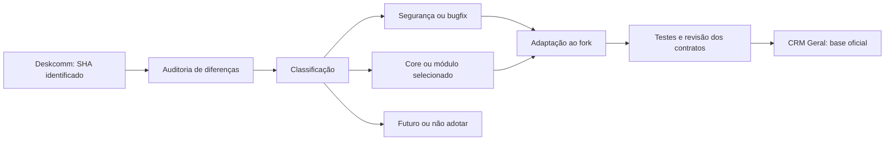

# Fase 2.5 — modelo de produto e roadmap funcional do CRM Geral

## 1. Resumo executivo

O CRM Geral é um CRM genérico, adaptável e comercializável, centrado em relacionamento, oportunidade e continuidade do trabalho comercial. Ainda não possui clientes, conforme o pedido desta fase. O produto base organiza contatos, empresas simples, oportunidades, atendimento, agenda, tarefas e resultado comercial. Capacidades de execução mais específicas ficam em módulos internos opcionais, sem marketplace ou forks permanentes por cliente.

**APROVADO:** decisões funcionais registradas na [Fase 2.3](UPSTREAM_FUNCTIONAL_SELECTION.md#decisões-do-usuário-após-a-fase-24) e modelo de distribuição da [Fase 2.4](PRODUCT_DISTRIBUTION_ARCHITECTURE.md). **CONFIRMADO documentalmente:** base desta fase `b24cdd9e41705ccab0ce49795b82bdc2496041f8`, após regularização publicada na main do fork. **INFERIDO / PROPOSTA:** classificação consolidada, sequência de blocos e critérios futuros de validação definidos aqui. O roadmap não autoriza execução, prazo, investimento ou disponibilidade comercial imediata.

Este documento é a referência consolidada de planejamento solicitada pelo usuário; não transforma a matriz histórica de 2.3 em implementação pronta. Fontes obrigatórias: relatórios 2.3 e 2.4. Fontes de apoio: [auditoria upstream 2.1](DESKCOMM_UPSTREAM_AUDIT.md), [runtime local](LOCAL_POSTGRES_SETUP.md), [hardening 2.2](UPSTREAM_HARDENING_PHASE_2_2.md), [AGENTS](../AGENTS.md), [CLAUDE](../CLAUDE.md) e [Sistema Vivo](doctrine/sistema-vivo.md). A auditoria é preservada não rastreada e não integra este commit. Não houve nova auditoria completa nem consulta a um upstream mais recente.

## 2. Visão do produto

O produto deve permitir que uma equipe reconheça com quem está falando, o que pode vender, quem é responsável e qual o próximo passo. A configuração adapta essa experiência a futuros clientes sem introduzir regras de um nicho como padrão universal.

As quatro famílias oficiais deste planejamento são CORE CRM, MÓDULOS OPCIONAIS, INFRAESTRUTURA / INTEGRAÇÕES e FUTURO / FORA DO ESCOPO ATUAL. Core expressa identidade e contratos compartilhados; módulo expressa uma capacidade adicional que pode ser desativada; infraestrutura sustenta essas capacidades; futuro não participa do primeiro roadmap funcional.

O core funciona sem novas integrações Google, Ads ou banco externo. Isso não elimina as integrações já utilizadas pelo produto: operação de canal e IA continua condicionada aos serviços respectivos. O desenvolvimento PostgreSQL local permanece suportado, mas não substitui a homologação da distribuição Supabase.

## 3. Decisões aprovadas

| Escolha | Direção de produto | Limite |
|---|---|---|
| 1A e 2B | Empresa com ficha própria e um vínculo simples por contato | Sem entidade Pessoa separada ou múltiplas afiliações inicialmente |
| 3A | Catálogo de tags por organização | Atribuição contextual em contatos, oportunidades e conversas; gestão global separada |
| 4A | Probabilidade por etapa e forecast ponderado simples | Sem probabilidade por IA ou dashboard avançado |
| 5A | Valor do negócio e ganhos comerciais | Comissão opcional ainda a definir; sem ERP financeiro |
| 6A | Propostas básicas, modelos simples, versão enviada e PDF | Sem assistente completo de briefing/revisão/envio |
| 7B | Campanhas com envio em lote agendado, opcionais | Sem marketing massivo irrestrito ou rodízio |
| 8A | Prospects e tarefas humanas | Sem outreach autônomo ou enriquecimento obrigatório |
| 9A | Core pequeno e capacidades opcionais por cliente | Sem catálogo público |
| 10A | Evoluir regras existentes e roteiros curtos | Sem workflow builder amplo |
| 11C e 12C | Nenhuma dessas novas integrações é prioridade | Google Calendar/Meet, Ads e banco externo fora do primeiro roadmap |

Distribuição definitivamente aprovada: uma base de código e uma linhagem de releases; por cliente, VPS dedicada, Supabase Project dedicado, domínio, configuração e secrets próprios, com gestão centralizada. Não há pendência sobre esse modelo. Schema comum do produto aprovado, flags e runtime condicionado são a direção inicial de planejamento; os detalhes do mecanismo ainda não estão implementados nem definidos por este documento.

## 4. Produto base

**Experiência padrão alvo para demonstração:** cadastrar um contato, associar opcionalmente uma empresa, registrar uma oportunidade e sua origem, organizar o funil e tags, consultar contexto de atendimento, registrar atividade/próxima tarefa, agendar compromisso local e interpretar ganhos e previsão por moeda. Equipe e configuração da organização dão contexto e controle de acesso a essa jornada.

Uma demonstração deve explicitar o que está operacional e o que está apenas planejado. O alvo inclui capacidades novas aprovadas; não afirma que todas já existem hoje. Propostas, campanhas e roteiros opcionais podem aparecer em demonstrações específicas depois de homologados, sem compor obrigatoriamente a primeira experiência. Comissão não pode ser apresentada como pronta enquanto suas regras estiverem abertas.

Histórico fictício pode demonstrar consulta da Inbox local; envio e recebimento reais precisam do canal homologado. IA sem credencial/serviço deve mostrar indisponibilidade compreensível, sem impedir o CRM manual. Demo comercial real exige Cliente Zero, não copiar seeds ou atalhos de Auth do desenvolvimento.

## 5. Core CRM

Classificação consolidada de planejamento, sustentada por 2.3 §§3–8, 12, 15–18 e 21–25 e pelas decisões do usuário:

| Grupo | Capacidade do core | Situação / tratamento |
|---|---|---|
| Relacionamento | Contatos e empresa com ficha própria; um vínculo por contato | Contatos existentes; empresa simples aprovada como evolução |
| Venda | Leads/oportunidades, pipelines/estágios, valor e moeda | Reutilizar contratos existentes; validar jornada antes de ampliar |
| Organização | Catálogo de tags, atribuições e filtros contextualizados | Direção aprovada; não confundir strings atuais com catálogo pronto |
| Previsão | Probabilidade por etapa e resumo ponderado | Evolução aprovada; definir tratamento de ausência de dados |
| Resultado | Negócios ganhos e relatórios comerciais | Sem interpretação de recebimento ou caixa |
| Atendimento | Inbox, contexto, notas textuais e responsabilidade | Evolução parcial; histórico consultável não exige novo canal |
| Continuidade | Atividades, tarefas humanas, agenda local e prospects | Reutilizar estruturas existentes; não criar cadastro paralelo preventivamente |
| Origem | Origem/UTM e relação com resultado local | Sem integração Ads obrigatória |
| Organização interna | Configuração do tenant, equipe, autorização e isolamento | Preservar RLS e contratos existentes |

Identidade, RLS, autorização, auditoria, eventos e navegação são fundações transversais. Correções necessárias para preservar esses contratos não dependem de ligar um módulo comercial. Melhoria de memória/contexto é indicada pela análise 2.3, mas recortes novos precisam demonstrar lacuna; não há aprovação para substituir o runtime de IA inteiro.

## 6. Módulos opcionais

Módulos são internos à mesma release. Flag controla disponibilidade; permissões controlam quem pode usar; configuração e saúde controlam se é possível executar. As dependências abaixo são confirmadas nas fontes quando indicadas; desenho simplificado e modos de execução são propostas a validar na especificação.

| Capacidade | Dependências | Runtime / worker / scheduler | Integração | Storage | Flag desde a primeira implementação |
|---|---|---|---|---|---|
| Propostas básicas | Contato/oportunidade, itens/modelos, autoria e versões; 2.3 §10 | Geração de documento; worker é decisão técnica, não requisito comprovado para versão básica; scheduler não é pressuposto | Nenhuma nova obrigatória; envio integrado é recorte separado | Confirmado no upstream; homologar retenção e acesso ao PDF na adaptação | Sim, UI/API/ferramentas e qualquer job |
| Campanhas agendadas | Público explícito, templates, supressão, canal, fila; 2.3 §11 | Worker e scheduler confirmados para envio agendado; retomada/dedupe necessários | Canal utilizado; WAHA para o recorte WhatsApp | Não demonstrado como obrigatório para texto; mídia exigiria contrato próprio | Sim, inclusive produtores, consumidores e jobs em andamento |
| Evolução de automações | Eventos, regras/condições/executores existentes; 2.3 §17 | Conforme ação: imediata, worker ou execução temporal; não impor scheduler/Redis a toda regra | Somente para ações externas escolhidas | Não obrigatório para ação puramente relacional | Sim para capacidades opcionais novas; preservar contratos compartilhados |
| Roteiros curtos | Turno do agente, perguntas/estado, skills e continuidade; 2.3 §14 | Integra runtime do agente; sem scheduler novo obrigatório | Provider de IA e canal quando o roteiro atuar no atendimento real | Não comprovado como dependência obrigatória | Sim, entrada no turno e ferramentas incluídas |
| Comissão futura | Regra aprovada, base de cálculo, responsáveis e momento | Indefinido; não projetar apuração automática antes das regras | Não definida | Não definida | Sim quando houver autorização para construir |

IA avançada, anexos em notas e lembretes automáticos são possibilidades analisadas em 2.3, mas não novos módulos aprovados automaticamente. Se selecionados em tarefa futura, precisarão de delimitação e flags próprias. Não construir um motor genérico de plugins para representar essa tabela.

## 7. Infraestrutura e integrações

Infraestrutura inclui banco/Auth/RLS, Storage e Realtime quando utilizados, eventos, execução assíncrona/temporal, logs/observabilidade, transporte de email operacional, gestão de configuração/secrets, imagens/releases e recuperação. Não são menus comerciais a importar integralmente do upstream.

Integrações de canal e IA já previstas são condicionais à capacidade usada. Ausência precisa ter estado visível e preservar ações manuais úteis. SMTP ou outro transporte operacional deve seguir o contrato de distribuição e diagnóstico da instalação, sem virar integração comercial prioritária por associação.

Google Calendar/Meet, Meta/Google Ads e PostgreSQL externo não entram no primeiro roadmap funcional. Não há necessidade de pesquisar fornecedores, criar contas, instalar dependências ou alterar recursos nesta fase.

## 8. Futuro / fora do core

| Recorte upstream | Classificação atual | Condição para reconsiderar |
|---|---|---|
| Financeiro integral, comandas, caixa, contas, fidelidade | FUTURO / FORA DO CORE; módulo especializado | Demanda real e regras financeiras próprias |
| Honorários | EXTENSÃO FUTURA / FORA DO CORE | Produto vertical explicitamente aprovado |
| Jev | FUTURO / NÃO PRIORITÁRIO | Lacuna demonstrada de avaliação de decisões; alcance e serviço externo aprovados |
| Banco externo genérico | FUTURO / NÃO PRIORITÁRIO | Caso delimitado de cliente real; não plataforma preventiva |
| SIP/AudioSocket e telefonia completa | FUTURO / FORA DO CORE | Demanda e infraestrutura de voz específica |
| Catálogo público de extensões / marketplace | FORA DO ESCOPO ATUAL | Módulos internos e necessidades recorrentes primeiro |
| Prospecção autônoma / outreach automático | FUTURO / NÃO SELECIONADO | Nova decisão de produto e operação; não consequência da lista de prospects |
| Marketing massivo / rodízio de números | FORA DO ESCOPO ATUAL / NÃO PRIORITÁRIO | Não faz parte do módulo de campanhas aprovado |
| Workflow builder amplo | FUTURO / NÃO SELECIONADO | Lacunas comprovadas nas regras existentes |
| Forecast IA/avançado, propostas assistidas completas | FUTURO | Evidência de necessidade após versão simples |

Recursos preexistentes fora desse alvo não serão removidos nesta tarefa. Classificar não autoriza exclusão de código, dados ou histórico.

## 9. B2B

Empresa é entidade/ficha própria. Contato pode possuir uma empresa vinculada. Empresa comercial não é a organização tenant do CRM: uma organização pode trabalhar com várias empresas comerciais, e o vínculo não concede acesso entre tenants ou instalações.

Não criar inicialmente Pessoa separada, várias empresas por pessoa ou grafo de afiliações. Preservar identidade e histórico do contato. A modelagem simplificada exige na especificação futura política de deduplicação, alteração/remoção de vínculo, permissões e efeitos sobre registros existentes. Vinculação direta empresa–oportunidade e múltiplos interlocutores não foram aprovados nas respostas; não tratá-los como pré-requisitos.

O bloco B2B vem antes da homologação de propostas na sequência sugerida por coerência de experiência, não por dependência técnica obrigatória. 2.3 §25 não demonstrou a cadeia B2B → propostas → financeiro como obrigatória.

## 10. Tags

Catálogo por organização, usado em contatos, oportunidades e conversas. Planejar nome e normalização, cor opcional, remoção de uma atribuição, gestão global, rename e merge. Cor não pode ser a única forma de reconhecer informação.

Remover tag de um registro difere de excluir do catálogo. Rename/merge precisam conservar significado e referências, inclusive filtros, automações e relatórios. A especificação deve resolver colisões, impacto da exclusão e regras que recriem tags. Não impor algoritmo de normalização ou política de deleção silenciosamente.

Concluir com uma jornada integrada: operador segmenta registros → encontra contexto → executa tarefa comercial → resultado continua atribuível ao segmento. Não exigir dashboard dedicado por tag para entregar o catálogo.

## 11. Forecast

Probabilidade configurada por etapa alimenta resumo ponderado de negócios abertos por moeda e período, conforme o recorte descrito em 2.3 §6. Valor, moeda e data prevista já integram contratos locais; probabilidade da etapa não é score individual de IA.

O alvo separa ausência de data/probabilidade, não soma moedas distintas e apresenta previsão como estimativa comercial. Não define percentuais padrão, probabilidade por IA, conversão automática de moedas ou múltiplas fontes. Tratamento de mudanças de etapa e critérios de agregação devem ser explicitados e validados antes da implementação.

## 12. Financeiro comercial

Inclui valor da oportunidade, negócios ganhos e relatórios de venda. Ganho comercial não comprova recebimento. Preservar dinheiro em cents e moeda e separar totais por moeda.

Contas a pagar/receber, caixa, comandas, lançamentos, fidelidade e ERP ficam fora do core e do primeiro roadmap. Comissão é opcional futura, condicionada à definição de base, momento de reconhecimento, responsáveis, alterações/estornos e finalidade do relatório. Nenhum percentual ou regra do upstream é adotado.

## 13. Propostas

Módulo aprovado: proposta básica, modelos simples, versão enviada preservada e PDF. O documento formaliza a oferta e se relaciona com o contexto comercial; não exige financeiro completo ou entidade Pessoa.

Versão enviada deve permanecer identificável e recuperável após nova edição. Especificação futura delimita itens/modelos, total/moeda, autoria, estados básicos, retenção/acesso, geração de PDF e significado de registrar envio. Envio por integração não é implicitamente aprovado por preservar versão enviada. No upstream há catálogo referenciado pelos itens; a adaptação precisa resolver essa dependência sem importar preventivamente um catálogo completo.

Entrada: contexto e composição comercial. Saída alvo: versão/documento consultável por quem tem acesso, atividade ligada ao registro e próximo passo humano. Briefing IA, revisão autônoma e jornada completa de envio ficam para depois.

## 14. Campanhas

Módulo aprovado: envio em lote agendado. Não limitar o produto apenas a listas com execução manual, pois isso não corresponde a 7B. Também não transformar essa escolha em marketing massivo irrestrito.

Requisitos mínimos para especificação e homologação futura:

- Público explícito e prévia identificável dos destinatários; supressão/opt-out rechecados antes da ação.
- Deduplicação de destinatários e efeitos, filas, retries delimitados e estado de execução visível.
- Limites de envio e critérios operacionais definidos antes de ativar; nenhum volume ou janela é fixado aqui.
- Auditoria de preparação, agendamento e ações relevantes; registros úteis sem exposição de dados pessoais em logs.
- Pausa/cancelamento e tratamento de ações já consumadas; retomada não pode reenviar silenciosamente.
- Isolamento por instalação e organização, inclusive canal, credenciais, jobs e destinos.
- Resposta recebida ligada à Inbox/contexto e a responsável/próximo passo, sem criar uma fila sem consumidor.

Operador observa preparação, fila, progresso e falha; envio ocorre no tempo configurado e precisa ser interrompível antes do efeito. Desligar flag não desfaz mensagem enviada. Critérios de consentimento operacional, supressão, retry, confirmação humana, janelas, concorrência e medição continuam abertos: essa lista é requisito de desenho, não política jurídica ou algoritmo já decidido.

## 15. Prospecção

Core: lista de prospects e tarefas humanas. Reutilizar identidade, origem, contatos e oportunidades; especificar a passagem de prospect para relacionamento/oportunidade sem duplicar histórico. Lista precisa de responsável e próximo passo, não descoberta autônoma.

Sem enriquecimento obrigatório, pesquisa automática ou outreach automático. Não exigir canal, provider de IA ou worker de abordagem para organizar uma lista manual. Esses recursos só podem retornar ao roadmap por nova decisão.

## 16. Automações e roteiros

Evoluir regras existentes e roteiros curtos. 2.3 §17 confirma eventos, condições e executores locais e follow-ups com grafo; inventário não prova suficiência operacional. Antes de ampliar, especificar a lacuna e aproveitar esses contratos.

Automação reage a evento com condição/ação; follow-up acompanha ao longo do tempo; roteiro coleta informações com estado durante atendimento; prompt orienta comportamento geral. A mesma ação não deve ter vários motores sem responsabilidade definida. Execução temporal pode requerer scheduler, mas uma regra relacional simples não ganha essa dependência por definição.

Roteiro precisa de conclusão, interrupção e continuidade humana com contexto. Falha em regra precisa indicar execução, responsável e forma de correção, que altera configuração ou próximo passo. Sem workflow builder generalista, novo editor de grafo ou substituição integral do turno do agente nesta fase.

## 17. IA

Preservar as capacidades existentes e sua revisão/continuidade com o humano. IA agrega contexto, sugestão e atendimento quando configurada; o CRM manual não deve depender de uma nova escolha de fornecedor. Provider por capacidade é direção arquitetural indicada por 2.3 §18, não autorização para adicionar todos os providers upstream.

RAG/indexação, transcrição produzida e memória ampliada são recortes condicionados a necessidade e serviços reais. Mostrar texto de transcrição já existente não exige construir seu serviço de produção. pgvector é dependência confirmada de indexação vetorial e não do cadastro, forecast ou tarefa humana. Jev e prospecção autônoma não entram no primeiro roadmap.

Qualquer evolução futura precisa delimitar alcance, custo/limites, ferramentas permitidas, revisão e informação entregue no handoff. Dados inferidos pela IA não devem virar cadastro confirmado silenciosamente.

## 18. Relatórios

Core: pipeline/conversão, ganhos por moeda, forecast simples, origem e atividades que respondam a perguntas comerciais concretas. Segmentação por tags só compara unidades definidas; contato, oportunidade e conversa não são a mesma contagem.

Relatórios precisam de período, filtros, unidade, tratamento de duplicidade e significado explícitos. Não inventar SLA ou chamar valor ganho de caixa. Produtividade deve permitir investigar contexto, evitando otimização por volume sem qualidade/resultado. Painéis de campanha vêm junto do módulo produtor; financeiro completo não gera dashboard no produto base.

## 19. Feature flags e configuração

Direção inicial: core pequeno + schema comum do produto aprovado + feature flags + runtime condicionado. Não importar todo o baseline upstream nem introduzir schema opcional preventivamente. Cada módulo novo traz sua flag desde a primeira implementação, sem aguardar a fase final de distribuição.

Cobertura: navegação/UI, API/ações, ferramentas MCP/IA, produtores/consumidores de eventos, workers e scheduler. Flag não substitui RLS/RBAC e prontidão de integração não equivale a autorização. Definir nível instalação/organização e autoridade para configurar sem conceder acesso a outro cliente.

Desligamento bloqueia novas ações e trata jobs em andamento conforme contrato próprio; preserva leitura/histórico/exportação autorizados quando aplicável. Configuração tem versão/rastreio, estado visível e comportamento quando faltar. Cache e rechecagem antes de efeito externo fazem parte da especificação futura. Nenhuma chave de flag ou mecanismo foi criado aqui.

## 20. Dependências

| Dependência / lacuna | Evidência documental | Bloqueia ou condiciona | Não deve bloquear por associação |
|---|---|---|---|
| Supabase real com Auth/RLS | 2.4 §§6, 8, 31; local não equivale à distribuição | Homologação comercial e contratos reais; D2 | Planejamento/desenvolvimento relacional local |
| Storage e permissões/recuperação de objetos | 2.3 §§10, 15; 2.4 §§6, 19 | Propostas PDF persistidas e anexos selecionados | Tags e forecast puramente relacionais |
| Realtime | 2.3 §§15, 25 e setup local | Paridade da observação ao vivo e implementação upstream que o usa | Consulta estática de histórico ou ideia de nota textual simplificada |
| Canal/WAHA homologado | 2.3 §§11–12, 15 | Envio/retorno real e campanhas WhatsApp | Prospects manuais, CRM comercial e leitura do histórico |
| Worker/scheduler e recuperação de execução | 2.3 §§11, 17; 2.4 §§4, 16 | Campanha agendada; regras/ações temporais conforme recorte | Toda regra ou geração de PDF obrigatoriamente |
| pgvector / ai_chunks pendentes no local documentado | LOCAL_POSTGRES_SETUP §§1, limitações; 2.3 §18 | RAG/indexação vetorial que use esses objetos | B2B simples, propostas básicas ou forecast |
| Artefatos/releases do fork | 2.4 §§4, 16, 31: defaults herdados não provam publicação própria | Distribuição limpa, update e rollout; D3/D6 | Desenvolvimento local autorizado |
| Flags completas | 2.4 §§11–12; direção desta fase | Primeira entrega de cada módulo opcional | Criar marketplace ou schemas por cliente |
| Migrations e compatibilidade | AGENTS; 2.4 §18 | Toda alteração de schema, install/update/RLS e dados existentes | Trazer migrations upstream em bloco |

Essas são lacunas e dependências documentadas, sem inspeção do ambiente externo nesta fase. Presença/saúde atual dos serviços e fechamento transitivo de dependências precisam ser revalidados na tarefa que implementar cada bloco. Backup/restore inclui dados, objetos e componentes usados; uma cópia SQL não comprova recuperação do conjunto.

## 21. Relação com distribuição

Uma instalação por cliente é isolada em infraestrutura; organizations/RLS continuam necessárias para unidades/equipes internas. B2B comercial não altera esse isolamento. Não criar branch por cliente ou personalizar imagem por marca.

| Fase técnica da 2.4 | Relação com o roadmap funcional |
|---|---|
| D2 — Supabase staging | Pode avançar em paralelo ao core local; condiciona prova de Auth/RLS/Storage/Realtime e módulos que os usam |
| D3 — artefato e provisionamento manual | Inclui imagens/manifesto do fork e instalação limpa; necessário antes de distribuir as capacidades homologadas |
| D4 — Cliente Zero | Demonstra produto base e módulos explicitamente ativados em instalação real, com falhas/ausências compreensíveis |
| D5 — backup/restore | Prova recuperação do conjunto de dados/objetos/configuração e componentes usados; necessário antes de piloto com responsabilidade comercial |
| D6 — update/rollback | Prova evolução app/schema/config/flags e recuperação compatível; módulos novos ampliam essa matriz de validação |

D2/D3 não aguardam terminar todos os módulos. D4 pode mostrar core sem campanhas; ativar campanhas só após seus gates próprios. Logs e backups mínimos começam em staging/demo; D5 formaliza a prova e não permite adiá-los. D6 não promete desfazer efeitos externos ou restaurar banco sem perda de escritas posteriores. Cliente Zero não é cliente contratado e não muda a premissa de ausência de clientes atuais.

## 22. Relação com upstream

Processo permanente de avaliação, sem automação criada nesta tarefa:

Identificar origem, congelar referência, comparar com baseline/fork e registrar decisão. Segurança pode ter prioridade própria sem autorizar um módulo inteiro. Adaptação preserva runtime local, RLS, marca, configuração e distribuição. Nunca merge automático, substituição integral de baseline/lockfile ou importação de regra comercial pela existência de código.

## 23. Roadmap por blocos

**Sequência PROPOSTA, sem datas ou autorização de execução.** A ordem considera contratos e dependências, risco de efeitos externos, possibilidade de validar localmente e necessidade de provas da distribuição. Cada bloco consolida/revalida o que já existe antes de adicionar o recorte selecionado.

| Ordem sugerida | Bloco | Entrega conceitual | Justificativa |
|---|---|---|---|
| A | Fundação configurável | Fronteiras core/módulos, configuração/prontidão, autorização e contratos de execução | Evita flags apenas visuais e acoplamento futuro |
| B | Jornada comercial base | Contatos, oportunidades/funil, atividades, prospects manuais, Inbox/contexto, agenda local e origem | Base de dados e jornada para demonstrar/validar os demais blocos |
| C | Organização e segmentação | Catálogo de tags e atribuições/filtros | Identidade consistente antes de segmentação avançada/campanhas |
| D | B2B simples | Empresa e vínculo único opcional por contato | Resolve modelo de identidade sem importar grafo de pessoas |
| E | Relatórios e forecast | Probabilidade por etapa, previsão ponderada e ganhos por moeda | Depende do significado de valor/status/data e serve para validar dados comerciais |
| F | Propostas | Modelo/documento básico, versões enviadas e PDF | Depende de contexto e persistência homologada; IA e financeiro não são pré-requisitos |
| G | Automação e roteiros | Recortes sobre regras existentes e roteiros curtos; revisão e rastreio | Esclarece continuidade e responsabilidade dos executores antes de ampliar ações externas |
| H | Campanhas agendadas | Público, supressão, fila, agenda de envio e acompanhamento | Maior risco operacional; depende de canal, execução interrompível e regras abertas resolvidas |
| I | Distribuição comercial | D2–D6 cruzadas com os blocos e Cliente Zero | Trilha transversal; começa cedo e fecha provas antes de piloto/rollout |

Dependências obrigatórias propostas: A → novas capacidades opcionais; B → C/D/E/F; C → campanhas que segmentem por tags; fundações de execução e regras operacionais → H. E depende de probabilidades e semântica comercial, não de D. F pode ser especificado após B em paralelo a D/E; D antes de F é preferência de experiência, não FK obrigatória. G não precisa criar roteiro para que uma campanha seja possível: H reutiliza os contratos de execução existentes validados, sem dependência artificial de um novo módulo.

I acompanha A–H: D2 em paralelo ao core, D3 antes de instalação real, D4 com o conjunto pronto, D5/D6 antes de evolução comercial segura. Comissão está fora da sequência de construção até suas regras serem decididas. Sem clientes reais, o roadmap se orienta pela demonstração verificável de capacidades genéricas, não por hipotético contrato de nicho.

## 24. Critérios de entrada/saída por bloco

Critérios são alvos futuros, não testes executados nesta fase.

| Bloco | Entrada | Saída verificável |
|---|---|---|
| A | Contratos existentes revalidados e módulo delimitado | Configuração/prontidão compreensível; permissões e flags cobrem executores; cenário desligado documentado e testável |
| B | Base local conhecida e jornada definida | Tela comprova contato → oportunidade → tarefa/agenda/contexto → resultado; identidade e responsável preservados; origem e dados fictícios coerentes |
| C | Registros e usos atuais de strings inventariados | Atribuição/remoção contextual e rename/merge preservam referências; isolamento e impacto global demonstrados |
| D | Contrato de contato e duplicidade especificados | Empresa própria e vínculo único opcionais pela tela, com migração compatível e sem Pessoa/afiliações múltiplas |
| E | Valores/status/moedas/datas e fonte por etapa definidos | Agregados conferíveis com dados controlados; moedas e dados ausentes separados; leitura comercial sem caixa/IA |
| F | Itens/modelos e registro de envio delimitados; Storage homologado no alvo | PDF e versão enviada recuperáveis com acesso autorizado; edição seguinte não altera versão histórica; desligamento do módulo coerente |
| G | Lacuna específica no motor atual, eventos e consumidores identificados | Regra/roteiro curto com conclusão/interrupção, falha visível e handoff com contexto; configuração corrigível |
| H | Políticas abertas resolvidas; público/supressão, canal e worker/scheduler homologados | Jornada controlada comprova agenda, pausa/cancelamento, supressão, dedupe/retry e retorno à Inbox; flag corta novas ações e trata pendências |
| I | Conjunto funcional candidato e manifesto compatível | Instalação limpa, demo real, restore e upgrade/recuperação demonstrados; inventário e limitações registrados |

Para implementação futura: typecheck/lint/testes pertinentes; schema com migration + baseline idempotente + MANIFEST, install/update e RLS entre organizações; UI/fluxo com prova visual; packaging com gates da distribuição. Verificação local sozinha não certifica cloud ou operação com canal real.

**Aplicação do Sistema Vivo ao planejamento:** entradas/saídas são contato/oportunidade/atividade e resultado/retorno; atividades e auditoria devem alimentar timeline/registro visível; navegação dá acesso às capacidades habilitadas; demandas precisam de responsável/próximo passo; configuração mostra falta/falha e permite correção; IA↔humano transfere contexto e decisão estruturada; falha deve permitir alterar regra/configuração/próximo passo. Ao implementar, nomear produtor, consumidor, tela e artefato concretos e atualizar mapa pertinente. Este documento define esses gates, sem declarar consumidores ou mapas novos implementados. Relatórios de leitura pura não criam ação automática nem anti-morte próprio; devem permitir entender a demanda que requer ação.

## 25. Decisões ainda abertas

- Comissão: base, cálculo, responsáveis, momento de reconhecimento, correção/estorno e finalidade; sem regra aprovada.
- Campanhas: objetivo operacional detalhado, critérios de público/supressão, revisão/confirmacão, limites/janelas, concorrência, retries, cancelamento/retomada e métricas; sem números inventados.
- Especificações dos recortes: deduplicação e alteração de vínculos B2B; normalização/colisões/exclusão global de tags; ausência de probabilidade/data e agregação de forecast; itens/catalogação e significado de envio de propostas.
- Configuração: autoridade e nível das flags, versão/cache, destino dos jobs em andamento e catálogo definitivo de capacidades.
- Operação/distribuição: escolhas de região/plano/provedor, identidade/namespace de release, compatibilidade, migration ledger, cofre e suporte; backups/retenção/RPO/RTO e política de manutenção conforme 2.4, sem reabrir a topologia aprovada.
- Recorte inicial de demo e especificações futuras precisam de validação antes da implementação; ordem proposta não vira autorização automática de desenvolvimento.

Não estão abertas: empresa própria com vínculo simples, ausência inicial de Pessoa, tags por organização, forecast simples por etapa, limite financeiro comercial, propostas básicas, campanhas agendadas opcionais, prospects humanos, core pequeno, ausência de catálogo público, regras/roteiros curtos e adiamento das novas integrações listadas. Distribuição dedicada por cliente com código/releases únicos permanece resolvida.

Encerramento documental: apenas este arquivo novo integra a Fase 2.5; nenhuma funcionalidade, migration, dependência, flag, módulo, recurso cloud, Docker, CI/CD ou secret foi alterado. Não foram executados testes da aplicação por se tratar de planejamento documental; revisão de escopo/diff e integridade do arquivo são as verificações aplicáveis. Commit local autorizado; sem push da branch desta fase.
